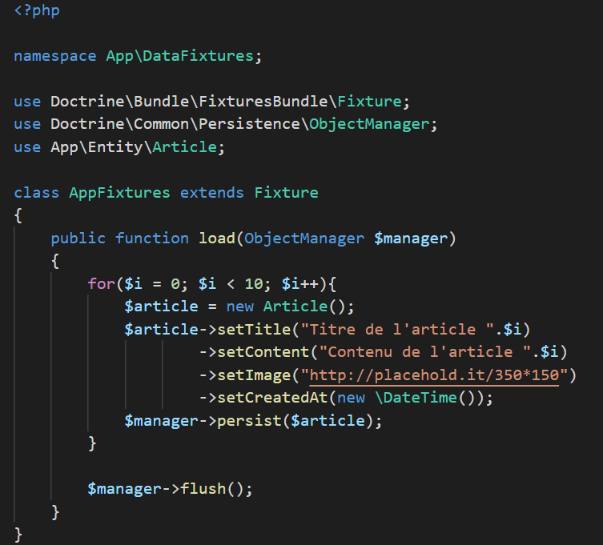

# Installer Symfony

Télécharger symfony ici: [https://symfony.com/download](https://symfony.com/download)

Créer le projet symfony avec la commande 

`symfony new --full my_project`

Lancer le serveur 

`php -S 127.0.0.1:8000 -t public/`

ou

`symfony serve`

# Informations utiles

Tutoriel officiel Symfony 5: [https://symfonycasts.com/screencast/symfony/setup](https://symfonycasts.com/screencast/symfony/setup)

Pour faire fonctionner Emmet avec twig

`Ctrl + Shift + P`

Saisir Settings, ouvrir le JSON et ajouter
`"emmet.includeLanguages": {
        "twig": "html"
}`

Thèmes bootstrap: [https://bootswatch.com/](https://bootswatch.com/)

# Les controllers

Créer un controller:

`php bin/console create:controller`

Exemple de fonction d'un controller

```  
    /**
     * @Route("/", name="home")
     */
    public function home(){
        return $this->render('blog/home.html.twig', [
            'title' => 'bienvenue sur le site'
        ]);
    }
```

Les annotations /** **/ permettent de définir la route sur laquelle cette fonction va être appelée et 
`$this->render` permet d'afficher une vue.

Le premier paramètre est le template twig et le 2ème est un tableau associatif permettant de lier un nom de variable à une valeur. On pourra ensuite l'afficher dans notre template en utilisant l'interpolation comme ceci:

`<h1>{{ title }}</h1>`


# Les vues

Twig est le moteur de templates utilisé par Symfony.

Dans le dossier templates de Symfony, il y a le fichier base.html.twig qui sert de layout global, pouvant être utilisé sur chaque page. Pour cela, il faut que sur chaque autre fichier html.twig, il y ait en tout premier: `` et qu'ensuite, le reste de la page soit englobé dans un block body (défini dans base.html.twig) comme ceci:

```



{% block body}

    Contenu



```

# Gestion de la base de données - Doctrine

Doctrine est un ORM (Object Relational Mapping), il permet de faire le lien entre une application et une base de données. Dans le cas de Symfony, il permet aux classes php et aux objets de refléter les tables et les données de la base de données.

#### Entity -> Table 

#### Manager -> Manipuler les données 

#### Repository -> Selectionner les données

Une migration est un fichier permettant de définir la base de données et les tables. L'utilisation de fichiers est pratique pour avoir la même base de données entre développeurs, il suffit de faire marcher les scripts de migration.

Les fixtures sont des scripts permettant des jeux de données (fausses données). Dans laravel, cela est appelé "seeders".

Le nom de la BDD, le user et le password sont définis dans le .env

#### La base de données peut être générée en exécutant la commande: `php bin/console doctrine:database:create`

#### Pour créer une entity (table): `php bin/console make:entity`

#### Mettre à jour le script des migrations: `php bin/console make:migration`

#### Lancer les migrations: `php bin/console doctrine:migrations:migrate`

#### Pour pouvoir utiliser les fixtures (scripts générant des données), il faut faire: `composer require orm-fixtures --dev`

##### Pour créer une fixture: `php bin/console make:fixtures`

Exemple de fixture: 



##### Pour charger les fixtures: `php bin/console doctrine:fixtures:load`
#### Attention, cela va purger la base de données et mettre les données des fixtures !
